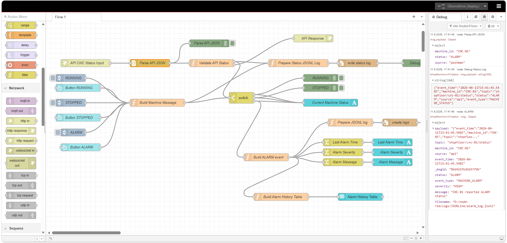
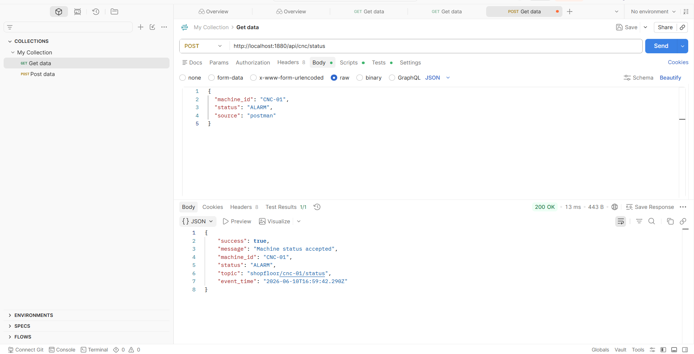
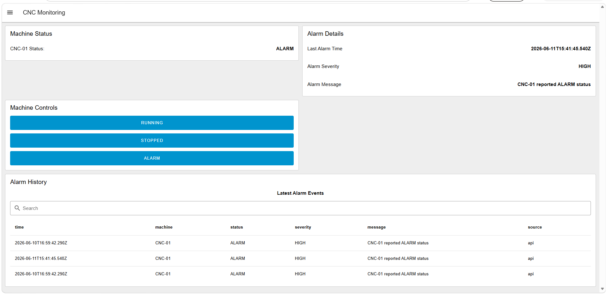
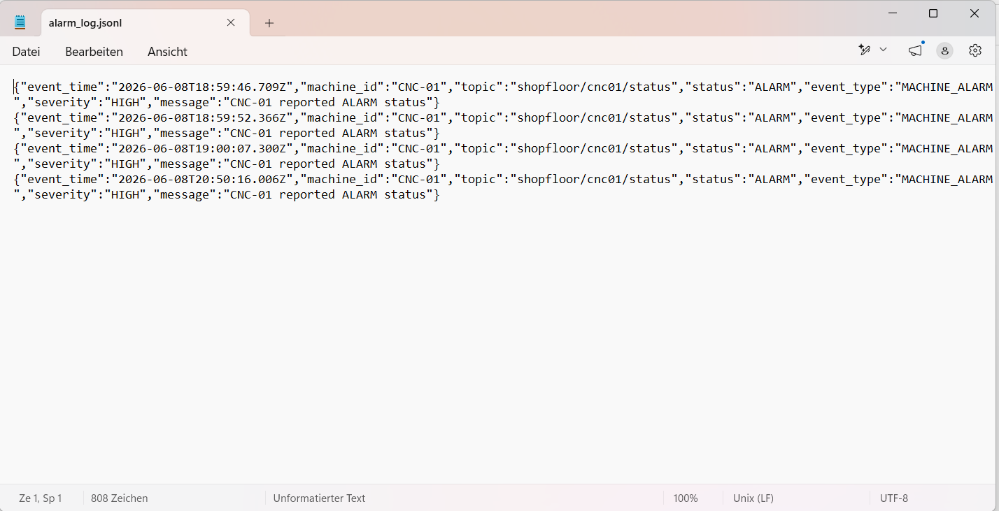
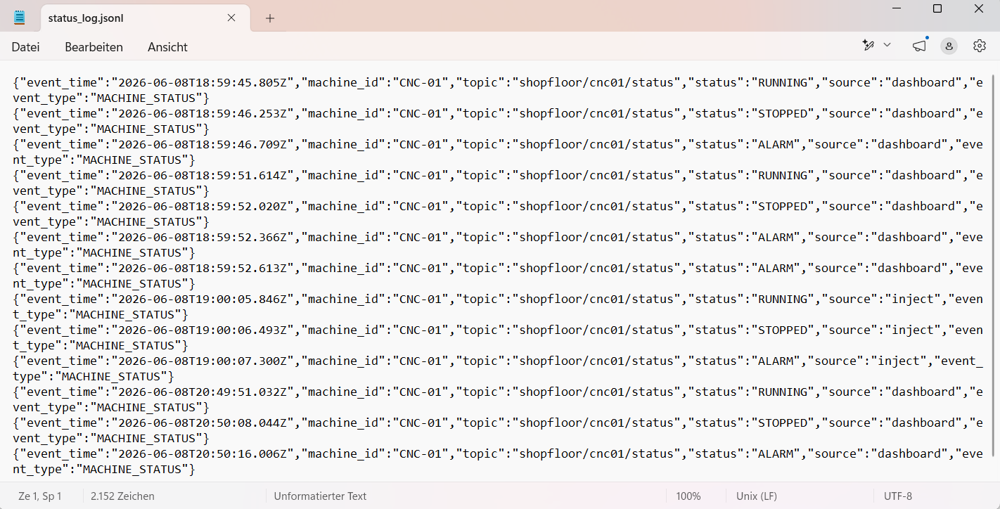

# Node-RED CNC Shopfloor Monitoring Lab
Node-RED lab project for CNC machine status monitoring, alarm detection, dashboard visualization, and JSONL log generation.


## Project Overview

This project is a Node-RED based lab for simulating CNC machine status monitoring, alarm detection, dashboard visualization, and JSONL log generation.

The project demonstrates basic OT/ICS monitoring logic using Node-RED flows, dashboard widgets, Function nodes, Switch nodes, and file-based logging.

## Features

- CNC machine status simulation: RUNNING, STOPPED, ALARM
- Dashboard buttons for status control
- Current machine status visualization
- Alarm details panel
- Alarm history table
- JSONL status logging
- JSONL alarm logging
- Duplicate ALARM detection
- Basic event enrichment using Function nodes

## Architecture

```text
Inject / Dashboard Button
→ Build Machine Message
   ├── Prepare Status JSONL Log → write status log
   └── Switch
       ├── RUNNING
       ├── STOPPED
       └── ALARM → Build Alarm Event
           ├── Prepare Alarm JSONL Log
           ├── Alarm Details
           └── Alarm History Table
```

## API Endpoint

The project includes a simple HTTP API endpoint that allows external tools such as Postman to send CNC machine status updates into Node-RED.

### Endpoint

```http
POST http://localhost:1880/api/cnc/status
```

### Example Request

```json
{
  "machine_id": "CNC-01",
  "status": "ALARM",
  "source": "postman"
}
```

### Example Success Response

```json
{
  "success": true,
  "message": "Machine status accepted",
  "machine_id": "CNC-01",
  "status": "ALARM",
  "topic": "shopfloor/cnc-01/status",
  "event_time": "2026-06-10T16:59:42.290Z"
}
```

### Supported Status Values

```text
RUNNING
STOPPED
ALARM
```

### API Flow Logic

```text
Postman
→ HTTP In: /api/cnc/status
→ Parse API JSON
→ Validate API Status
→ HTTP Response
→ Status JSONL logging
→ Switch logic
→ Dashboard update
→ Alarm event handling
→ Alarm JSONL logging
→ Alarm history table
```

### API Flow Overview



### Postman API Test



## Screenshots

### Dashboard Overview



### Alarm JSONL Log Output



### Status JSONL Log Output



